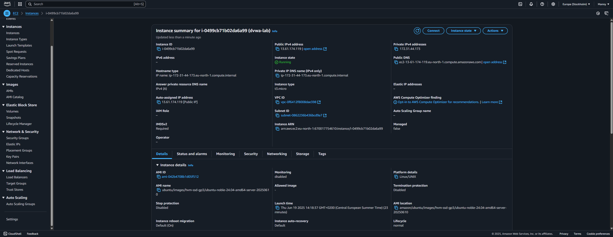
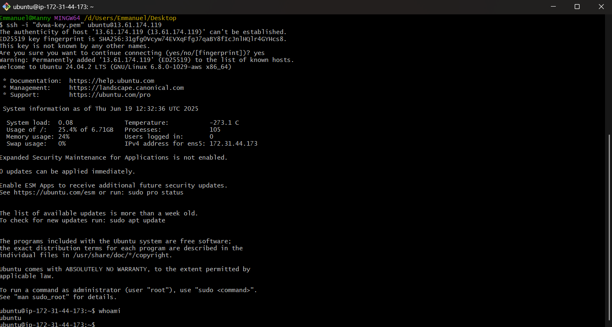

# AWS DVWA Cloud Security Lab

This repository documents my hands-on project where I set up a vulnerable web application (DVWA) on an AWS EC2 Ubuntu instance and practiced cloud security.

## What I Did

- Launched Ubuntu 24.04 EC2 instance on AWS.
- Installed Apache, MySQL, PHP, and DVWA.
- Practiced SSH access and network security configuration.
- Took screenshots to document key steps.

## Screenshots

---

More details and hardening steps coming soon!
